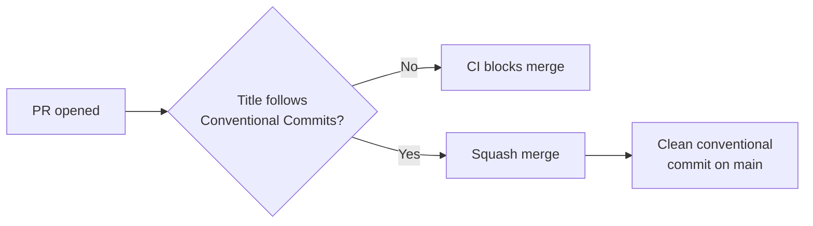
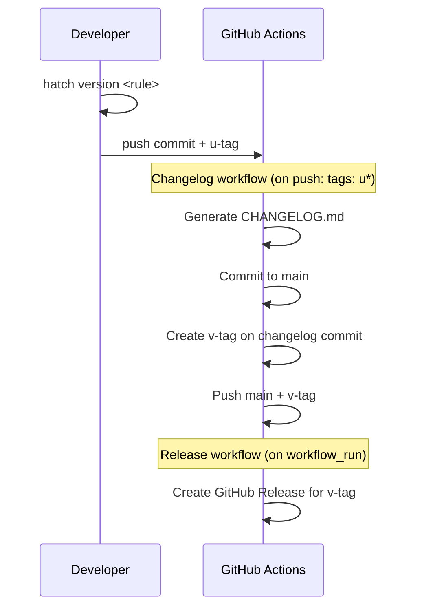

# legendary-octo-happiness

A reference implementation for automated changelog and release workflows using Conventional Commits.

## Motivation

This repo solves a chain of problems that come up when trying to automate releases for GitHub projects:

- **Inconsistent commit history** — Without enforcement, commit messages are useless for automation.
- **Manual changelogs** — Tedious and error-prone. With structured commits, [git-cliff](https://git-cliff.org/) can generate them.
- **Manual releases** — Creating GitHub Releases by hand is repetitive.
- **Force-tagging** — Tagging *before* generating the changelog means the tag misses the changelog commit, requiring a force-update.
- **`GITHUB_TOKEN` limitation** — Tags pushed by `GITHUB_TOKEN` [don't trigger `on: push` workflows](https://docs.github.com/en/actions/security-for-github-actions/security-guides/automatic-token-authentication#using-the-github_token-in-a-workflow), breaking naive tag-based release chains.

This repo addresses all of these with a two-tag pipeline and `workflow_run` chaining.

## How it works

### PR merge flow



Squash merging makes the PR title the commit message, guaranteeing a clean, parseable history.

### Release flow



The result on `main`:

```text
... feature commits ...
commit A  (version bump)      ← u1.1.0
commit B  (update CHANGELOG)  ← v1.1.0   ← GitHub Release
```

The `v` tag always includes the updated changelog — no force-tagging needed.

## Setting up from scratch

How to replicate this setup in a new repository. Each step references the actual file in this repo.

### 1. Repository settings

In your GitHub repo settings:

- **Allow only squash merges** (disable merge commits and rebase merges)
- **Enable auto-delete head branches**

These ensure every commit on `main` comes from a squash merge with the PR title as the message.

> **Note:** This is a manual step — it can't be configured via code.

### 2. PR title enforcement

Add [`amannn/action-semantic-pull-request`](https://github.com/amannn/action-semantic-pull-request) to validate PR titles against Conventional Commits, and a PR template to remind contributors of the convention.

See: [`.github/workflows/pr-title.yml`](.github/workflows/pr-title.yml), [`.github/pull_request_template.md`](.github/pull_request_template.md)

### 3. Automatic PR labels

Label PRs based on their Conventional Commits prefix. These labels feed into GitHub's auto-generated release notes categories.

See: [`.github/workflows/conventional-label.yml`](.github/workflows/conventional-label.yml), [`.github/release.yml`](.github/release.yml)

### 4. Version management

Use [`hatch-regex-commit`](https://github.com/frankie567/hatch-regex-commit) so `hatch version <rule>` bumps the version, creates a commit, and tags it.

1. Add `hatch-regex-commit` to build requires in `pyproject.toml`:

   ```toml
   [build-system]
   requires = ["hatchling", "hatch-regex-commit"]
   ```

2. Create a version file (e.g., [`src/legendary_octo_happiness/__about__.py`](src/legendary_octo_happiness/__about__.py)):

   ```python
   __version__ = "0.1.0"
   ```

3. Configure `[tool.hatch.version]` to use the `u` tag prefix:

   ```toml
   [tool.hatch.version]
   source = "regex_commit"
   path = "src/legendary_octo_happiness/__about__.py"
   tag_name = "u{new_version}"
   tag_sign = false
   ```

4. Mark the version as dynamic in `[project]`:

   ```toml
   dynamic = ["version"]
   ```

See: [`pyproject.toml`](pyproject.toml)

### 5. Changelog generation

Add a git-cliff config and a GitHub Actions workflow that triggers on `u` tags. The workflow:

1. Checks out `main` with full history
2. Verifies the tag is on `main`
3. Runs git-cliff to generate `CHANGELOG.md`
4. Commits the changelog, creates the `v` tag, and pushes both

See: [`cliff.toml`](cliff.toml), [`.github/workflows/changelog.yml`](.github/workflows/changelog.yml)

### 6. Automated releases

Add a release workflow that triggers via `workflow_run` after the Changelog workflow completes.

This sidesteps the `GITHUB_TOKEN` limitation: instead of triggering on `push: tags: v*` (which won't fire for tags pushed by `GITHUB_TOKEN`), the workflow listens for the Changelog workflow's completion.

See: [`.github/workflows/release.yml`](.github/workflows/release.yml)

### 7. Claude Code

Add a [`.claude/CLAUDE.md`](.claude/CLAUDE.md) file with project guidance so [Claude Code](https://claude.ai/code) understands the build commands, PR conventions, and release flow.

## Pitfalls

Problems encountered during setup, with solutions.

### Tera macros in git-cliff templates

Using `macro` definitions in the cliff.toml body template causes `Function not found` errors. git-cliff's Tera environment doesn't support custom macros in the body context. **Solution:** Inline the URL directly in the template. See [#7](https://github.com/iris-hep/legendary-octo-happiness/pull/7).

### `GITHUB_TOKEN` tags don't trigger workflows

Tags pushed by `GITHUB_TOKEN` don't fire `on: push: tags` events. **Solution:** Use `workflow_run` chaining — the Release workflow triggers when the Changelog workflow completes, not on tag push.

### Tag push events have no branch context

You can't use a `branches` filter with `on: push: tags` — GitHub doesn't provide branch context for tag events. **Solution:** Add an explicit verification step in the workflow that checks whether the tag's commit is an ancestor of `main`.

### `hatch-regex-commit` needs a file path

The `path` in `[tool.hatch.version]` must point to a Python file like `__about__.py`, not `pyproject.toml`. The version field in `[project]` must be `dynamic`.

## Configuration reference

| File | Purpose |
| ---- | ------- |
| [`pyproject.toml`](pyproject.toml) | Build config, version management with `hatch-regex-commit` |
| [`cliff.toml`](cliff.toml) | git-cliff changelog format and commit parsing rules |
| [`src/legendary_octo_happiness/__about__.py`](src/legendary_octo_happiness/__about__.py) | Single source of truth for package version |
| [`.github/workflows/pr-title.yml`](.github/workflows/pr-title.yml) | Enforce Conventional Commits on PR titles |
| [`.github/workflows/conventional-label.yml`](.github/workflows/conventional-label.yml) | Auto-label PRs based on commit type |
| [`.github/workflows/changelog.yml`](.github/workflows/changelog.yml) | Generate CHANGELOG.md and create `v` tag on `u` tag push |
| [`.github/workflows/release.yml`](.github/workflows/release.yml) | Create GitHub Release after Changelog workflow completes |
| [`.github/release.yml`](.github/release.yml) | Categorize auto-generated release notes by label |
| [`.github/pull_request_template.md`](.github/pull_request_template.md) | PR checklist reminding contributors of title convention |
| [`.claude/CLAUDE.md`](.claude/CLAUDE.md) | Project guidance for Claude Code |
| [`CONTRIBUTING.md`](CONTRIBUTING.md) | Allowed commit types, release instructions |

## Contributing

See [CONTRIBUTING.md](CONTRIBUTING.md).
